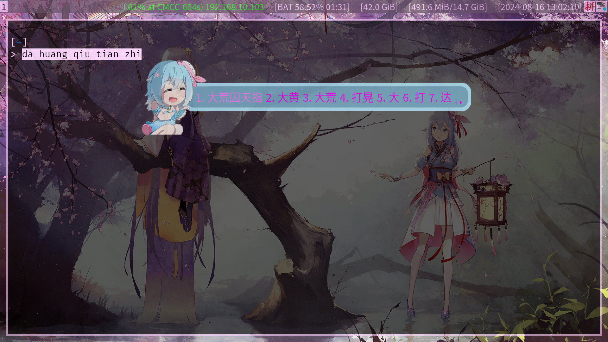

# 简介

- 制作工具：[搜狗输入法皮肤编辑器](https://pinyin.sogou.com/skins/design.php), [ssfconv](https://github.com/fkxxyz/ssfconv)

- 素材源自[【Procreate】海伊倒立武功秘籍之大荒囚天指！（？）-海伊表情包绘画过程【海伊2024诞生日】](https://www.bilibili.com/video/BV1nT421k7Dk/?share_source=copy_web&vd_source=07889427324b59af06fa17a79c7a5378), 已经作者许可。

# 效果



# 安装

```sh
git clone https://github.com/BreakTheMyth/fcitx5-medium5-haiyi.git ~/.local/share/fcitx5/themes/ && echo "finish"
```

# 卸载

```sh
rm -rf ~/.local/share/fcitx5/themes/海伊倒立武功秘籍之大荒囚天指！（？）/ && echo "finish"
```

# 补充

- 安装完成后需要手动启用主题，具体操作：执行`fcitx5-configtool`命令 > 弹出[fcitx 配置]窗口 > 点击顶部菜单栏中[附加组件]选项 > 搜索"经典用户界面"或找到[界面]分组下的[经典用户界面] > 点击[经典用户界面]右侧[配置]按钮 > 弹出[经典用户界面 — Fcitx 配置]对话框 > 点击[主题]下拉菜单 > 选择[海伊倒立武功秘籍之大荒囚天指！（？）]选项 > 点击[确定]选项
- 尊贵 Arch Linux 用户可移步至 [AUR](https://aur.archlinux.org/packages/fcitx5-medium5-haiyi)
